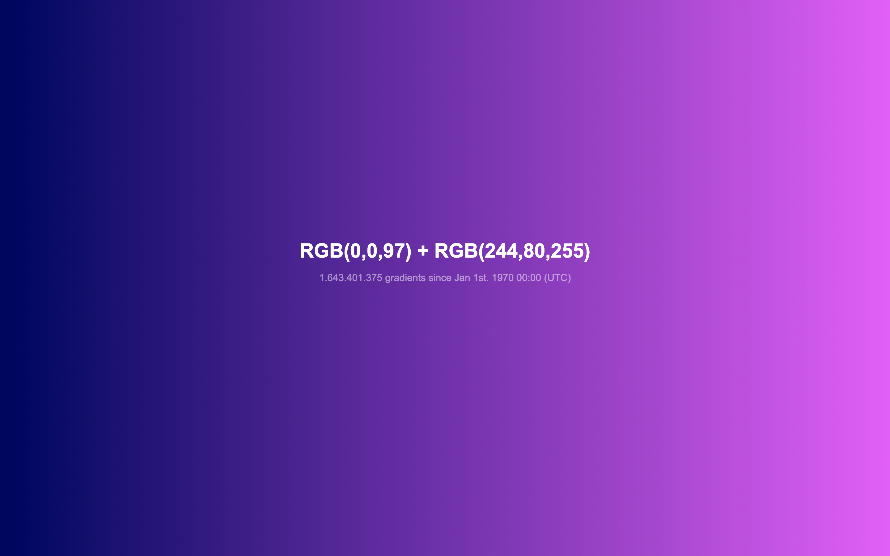

# Unix gradient

A long-running color generator that changes every second, driven by the Unix timestamp. Based on calculations starting from the Unix epoch on January 1, 1970, it will produce unique gradients for the next 8.9 million years. Designed for both Philips Hue lights and web.

- [Unix gradient web (unixgradient.org)](web)
- [Unix gradient Philips Hue](philips-hue)
